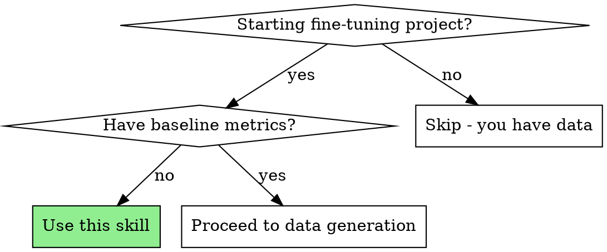
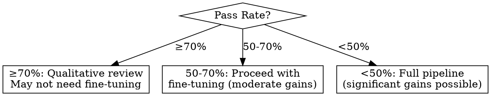

# Base Model Selector + Baseline Evaluation

## Overview

Evaluate base models against your domain rubric BEFORE committing to fine-tuning. Most projects skip this and waste resources fine-tuning models that were already good enough—or fine-tuning models that need fundamental architectural changes instead.

**Core principle:** Never fine-tune without baseline data. The baseline tells you if fine-tuning will help and by how much.

## When to Use



**Use when:**
- Starting any fine-tuning project
- Switching base models mid-project
- Evaluating if existing model needs fine-tuning for new domain

**Skip when:**
- You already have baseline evaluation data
- Pure prompting project (no fine-tuning planned)

## The Process

### Step 1: Deep Research (EXHAUSTIVE)

This is NOT quick research. You must build a comprehensive comparison table covering ALL viable candidates for your target size and use case.

#### 1a. Identify ALL Candidates

Search for models in your target parameter range. For 7-10B, check:

| Family | Models to Evaluate |
|--------|-------------------|
| **Qwen** | Qwen 3 8B, Qwen 2.5 7B, Qwen 2.5 14B |
| **Llama** | Llama 3.1 8B, Llama 3.2 3B/8B |
| **Mistral** | Mistral 7B v0.3, Zephyr 7B, OpenChat 3.5 |
| **Google** | Gemma 2 9B, Gemma 3 4B |
| **Microsoft** | Phi-4 14B, Phi-4-mini 3.8B |
| **DeepSeek** | DeepSeek-R1-Distill-Qwen-7B, DeepSeek-R1-Distill-Llama-8B |
| **Specialized** | Domain-specific fine-tunes on HuggingFace |

**Search queries to run:**
- `"best [size] parameter LLM 2025 [your domain]"`
- `"[model family] vs [model family] comparison 2025"`
- `"open source LLM [your domain] fine-tuned 2025"`
- `"best LLM for [specific capability] 2025"` (e.g., empathy, coding, reasoning)

#### 1b. Evaluate Each Factor

| Factor | Questions to Answer |
|--------|---------------------|
| **License** | Apache 2.0 / MIT / Llama? Commercial use allowed? |
| **Context length** | Fits your longest input? (calculate: turns × 2 × ~200 tokens) |
| **Architecture focus** | Reasoning-focused or conversation-focused? |
| **Domain fit** | Research shows this model type works for your domain? |
| **Recency** | Latest generation? Newer models often outperform. |
| **Quantization** | GGUF available? Quality at Q4_K_M? |
| **Community** | Active development? Known issues? |

#### 1c. Domain-Specific Research

**CRITICAL:** Different domains need different model characteristics.

| Domain | Prefer | Avoid |
|--------|--------|-------|
| **Therapeutic/Empathy** | Chat-focused, dialogue-optimized | Reasoning-focused (R1, o1, Phi-4) |
| **Coding** | Code-trained, reasoning-capable | Pure chat models |
| **Math/Logic** | Reasoning models, thinking modes | Pure instruction-following |
| **Creative Writing** | High temperature tolerance, natural flow | Overly formal models |
| **Factual Q&A** | Knowledge-dense, grounded | Creative/hallucination-prone |

**Example research for therapeutic coaching:**
> "Models such as DeepSeek R1, OpenAI o3, and o1 excel in logical reasoning but fall short in conversational fluency and emotional responsiveness."

This means: **avoid** DeepSeek R1 distills for therapy, even though they're excellent models.

#### 1d. Build Comparison Table

Create a comprehensive table with ALL candidates:

```markdown
| Model | Params | License | Context | Release | Domain Fit | Notes |
|-------|--------|---------|---------|---------|------------|-------|
| Qwen 3 8B | 8.2B | Apache 2.0 | 128K | Apr 2025 | ⭐⭐⭐⭐ | Thinking/non-thinking modes |
| ... | ... | ... | ... | ... | ... | ... |
```

Rate domain fit on a scale (⭐ to ⭐⭐⭐⭐⭐) based on research findings.

### Step 2: Select Primary Candidate

Based on research, select ONE candidate. Document:
- Why this model over alternatives
- Expected strengths for your domain
- Potential concerns to watch for

Also identify a **backup candidate** in case primary underperforms.

### Step 3: Pull Model

```bash
# Ollama
ollama pull qwen3:8b

# Or llama.cpp with GGUF
huggingface-cli download Qwen/Qwen3-8B-Instruct-GGUF qwen3-8b-instruct-q4_k_m.gguf

# Verify it runs
llama-cli -m model.gguf -p "Hello, testing."
```

### Step 4: Generate Evaluation Scenarios

Create ~50 diverse scenarios from your input taxonomy. These are INPUTS only (user messages), not full conversations.

```python
# Generate opening messages covering your taxonomy
scenarios = []
for topic in taxonomy["topics"]:
    for subtopic in topic["subtopics"]:
        for style in ["terse", "conversational", "detailed"]:
            scenarios.append(generate_opening(topic, subtopic, style))
```

**Critical:** Scenarios must cover your full input distribution, including edge cases.

### Step 5: Run Base Model

Run the base model on each scenario. Collect single-turn responses.

```python
responses = []
for scenario in scenarios:
    response = generate(
        model=model_path,
        prompt=scenario,
        system=your_system_prompt,
    )
    responses.append({
        "scenario": scenario,
        "response": response,
    })
```

### Step 6: Assess with Rubric

Run your domain rubric on each response. Calculate pass rate.

```python
results = []
for item in responses:
    assessment = assess_single_turn(item["scenario"], item["response"])
    results.append(assessment)

pass_rate = sum(1 for r in results if r.passed) / len(results)
```

### Step 7: Make Decision



| Pass Rate | Decision | Next Step |
|-----------|----------|-----------|
| **≥ 70%** | Likely sufficient | Do qualitative review. If specific failure modes exist, consider targeted fine-tuning. Otherwise, deploy base model. |
| **50-70%** | Moderate improvement possible | Proceed with fine-tuning. Document failure modes to guide data generation. |
| **< 50%** | Significant improvement needed | Full pipeline. Analyze failures—are they fixable with data, or architectural? |

### Step 8: Document Results

Create `docs/base-model-evaluation.md`:

```markdown
# Base Model Evaluation

**Date:** YYYY-MM-DD

## Model Selection

### Research Summary

[Summary of models considered and why primary was chosen]

| Model | Domain Fit | Why Considered | Why Selected/Rejected |
|-------|------------|----------------|----------------------|
| Qwen 3 8B | ⭐⭐⭐⭐ | Latest gen, non-thinking mode | **SELECTED** - best chat quality |
| DeepSeek-R1-7B | ⭐⭐ | Strong reasoning | Rejected - poor empathy per research |
| ... | ... | ... | ... |

### Selected Model

- **Model:** qwen3:8b-instruct-q4_k_m
- **Parameters:** 8.2B
- **License:** Apache 2.0
- **Context:** 128K tokens

## Evaluation Results

- **Scenarios:** 50
- **Pass rate:** XX%
- **Decision:** [DEPLOY / FINE-TUNE / FULL PIPELINE]

## Failure Analysis

| Criterion | Failure Count | Pattern |
|-----------|---------------|---------|
| CQ3 | 12 | Jumps to advice without validation |
| CQ8 | 3 | Missed crisis signals |

## Qualitative Notes

[Specific observations about response quality]

## Next Steps

[What happens next based on decision]
```

## Outputs

1. **Research table** — All candidates with domain fit ratings
2. **Selected model** — Name, version, and rationale
3. **Baseline pass rate** — Percentage on rubric
4. **Failure analysis** — Which criteria fail most
5. **Decision document** — `docs/base-model-evaluation.md`

## Common Mistakes

| Mistake | Why It's Wrong |
|---------|---------------|
| Shallow research | Missing better candidates; picking based on familiarity |
| Ignoring domain fit | Reasoning models fail at empathy tasks; chat models fail at logic |
| Using old model lists | Models release monthly; 6-month-old recommendations are stale |
| Skipping baseline | You won't know if fine-tuning helped |
| Testing multiple models in parallel | Wastes time—pick one, evaluate, iterate if needed |
| Using full conversations for baseline | Single-turn is enough to assess base capability |
| Ignoring qualitative review at high pass rates | Numbers hide specific failure modes worth fixing |
| Proceeding without documenting failures | Failure patterns should guide data generation |

## Quick Reference

```bash
# 1. Research (use web search extensively)
# Build comparison table with 8-12 candidates

# 2. Pull model
ollama pull qwen3:8b
# or
huggingface-cli download Qwen/Qwen3-8B-Instruct-GGUF

# 3. Generate scenarios
uv run python generator.py --scenarios-only 50

# 4. Run evaluation
uv run python evaluate_base_model.py --model qwen3:8b

# 5. Check results
cat docs/base-model-evaluation.md
```
